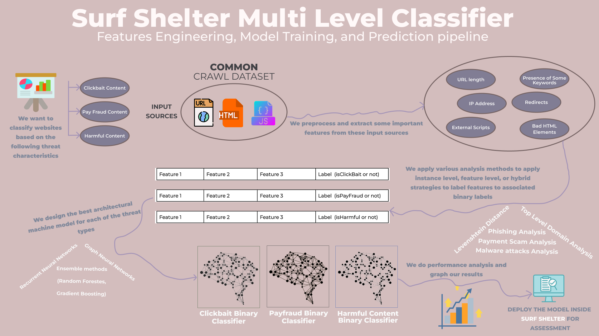

# Surf Shelter: Taming the Wild Web 🌊

Welcome to Surf Shelter, your trusty companion in the quest to make the internet a safer place! 🛡️ We're building a multi-label classification system that sniffs out the nasties lurking in the digital depths – from clickbait pirates 🎣 to pay fraud phantoms 👻 and harmful horrors 💀.

## What We Do 🏄‍♀️

Surf Shelter scans the web to detect potential risks in website content. Using machine learning, feature extraction, and smart classification, it identifies online threats across multiple categories:

* 🎣 Clickbait – Misleading headlines that grab attention but lack substance.
* 👻 Pay Fraud – Deceptive schemes designed to trick users into losing money.
* 💀 Harmful Content – Malicious links, scams, and unsafe online elements.

## How to Get on Board 🚢

1.  **Clone the Ship:**

    ```bash
    git clone https://github.com/KarkiAdit/surf-shelter-multi-label-classifier.git
    cd surf-shelter-multi-label-classifier
    ```

2.  **Create a Virtual Environment:**

    ```bash
    python -m venv .venv
    source .venv/bin/activate  (macOS/Linux)
    venv\Scripts\activate  (Windows)
    ```

3.  **Install Dependencies:**

    ```bash
    pip install -r requirements.txt
    ```

## Setting Sail (Usage) 🧭

```python
from surf_shelter_multi_label_training_pkg_v0 import SSMultiLabelClassifier

# Initialize the classifier
classifier = SSMultiLabelClassifier()

# Make predictions
predictions = classifier.predict(["example_url", "example_metadata", "example_scripts"])

# Print predictions
print(predictions)

# ... and many more adventures await! ...
```

## 🗺️ The Journey: Training Pipeline  

Our training process follows a structured path:  

1. **Data Preprocessing** – Cleaning and refining raw data  
2. **Feature Extraction** – Identifying key features
3. **Model Training** – Teaching the model to classify content
4. **Model Evaluation** – Testing the model’s reliability

  

🔍 *(For a detailed explanation, check the [documentation](https://docs.google.com/document/d/1GzK7yKnEFJ5sppMHxrAM7Zl3VyXcxmgw7uIJh8zkc80/edit?usp=sharing))*  
